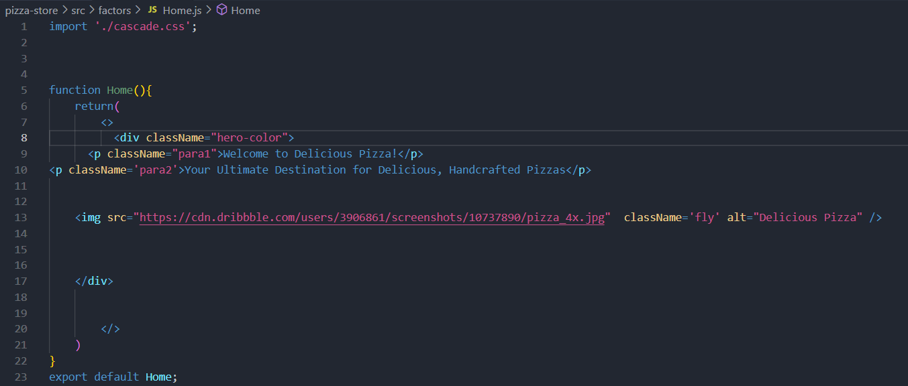
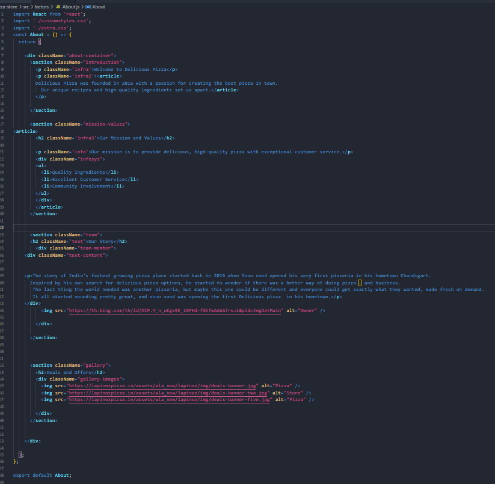
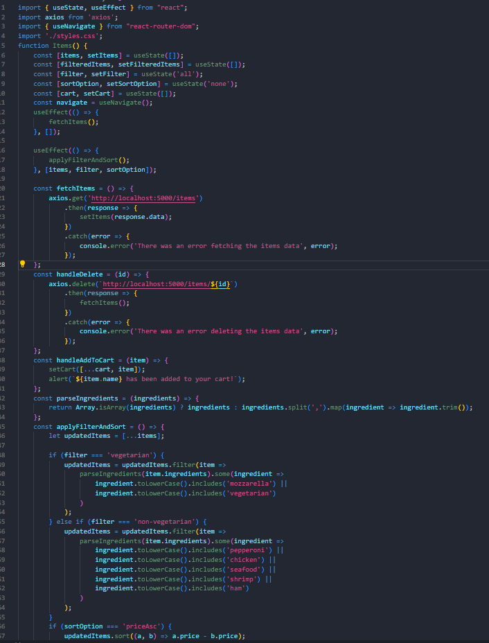
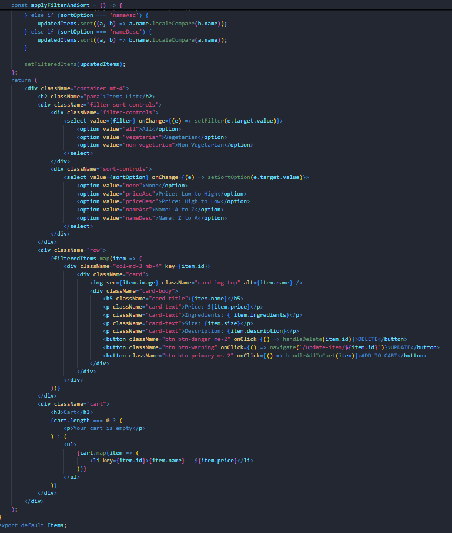
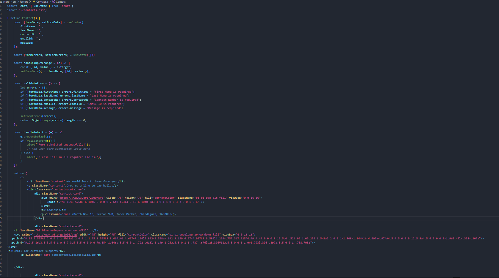
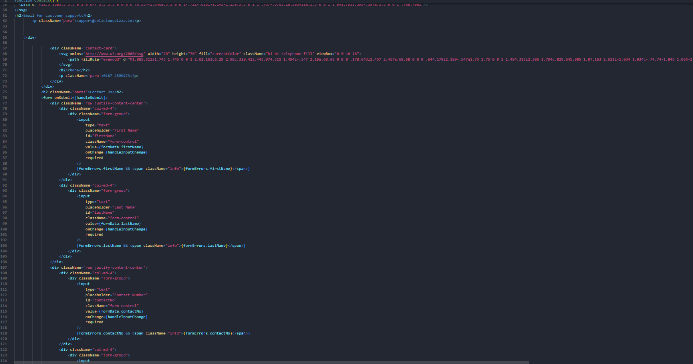
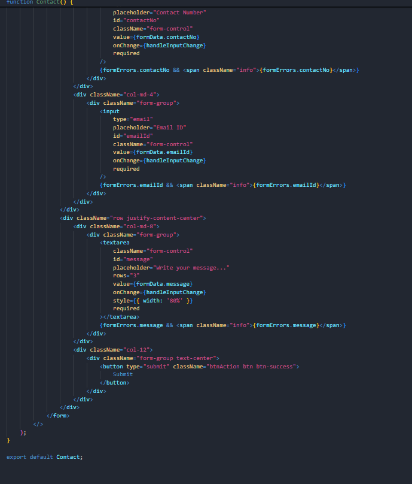

   # Pizza Store Application

## Overview

The Pizza Store Application is a React-based web app that allows users to browse and manage pizza items. It features a user-friendly interface for viewing pizza details, filtering and sorting items, and accessing contact information.

## Screenshots

### Home Page

### About page

### Pizza Details

### Contact details

## Setup Instructions

### Prerequisites
- **Node.js** (version 14.x or higher)
- **npm** (Node Package Manager)

### Installation

1. **Clone the Repository**

     powershell
   git clone <repository-url>
   cd <repository-directory>

 2.  **Install Dependencies**

  powershell
npm install

  3.**Start the Development Server**

  powershell
   npm start

   4.**Open the Application**

Visit http://localhost:3000 in your web browser.

  # Component Descriptions
 # App.js
The main component that sets up routing and renders other components.

 # Items.js
Handles fetching and displaying pizza items from the db.json file. Includes filtering and sorting functionality.

 # Contact.js
Displays contact information, including address, phone number, and email.

 # Usage Instructions

Filter and Sort: Use the filtering and sorting options to customize the displayed pizzas.

View Details: Click on a pizza item to view detailed information.

Contact Information: Visit the "Contact" page to find store contact details.

# Data Structure
db.json
The db.json file contains data for the pizza items. The structure is as follows:

id: Unique identifier for the pizza.
image: URL of the pizza image.
name: Name of the pizza.
price: Price of the pizza.
ingredients: List of ingredients.
size: Available sizes for the pizza.
description: Description of the pizza.

Example JSON Entry:

 "items": 
    {
      "image": "https://images.ricardocuisine.com/services/recipes/pizza-1498148703.jpg",
      "name": "Margherita Pizza",
      "price": 398,
      "ingredients": "Tomato,Mozzarella,Basil,Pizza Dough,Fresh Basil Leaves",
      "size": "Medium",
      "description": "Classic Margherita Pizza with fresh tomato, mozzarella.",
      "id": "1"
    },

 # Troubleshooting
Application Not Visible: Ensure the server is running and check the browser console for errors.
Dependencies Issues: Verify that all dependencies are installed correctly. Run npm install again if needed.

# Getting Started with Create React App

This project was bootstrapped with [Create React App](https://github.com/facebook/create-react-app).

## Available Scripts

In the project directory, you can run:

### `npm start`

Runs the app in the development mode.\
Open [http://localhost:3000](http://localhost:3000) to view it in your browser.

The page will reload when you make changes.\
You may also see any lint errors in the console.

### `npm test`

Launches the test runner in the interactive watch mode.\
See the section about [running tests](https://facebook.github.io/create-react-app/docs/running-tests) for more information.

### `npm run build`

Builds the app for production to the `build` folder.\
It correctly bundles React in production mode and optimizes the build for the best performance.

The build is minified and the filenames include the hashes.\
Your app is ready to be deployed!

See the section about [deployment](https://facebook.github.io/create-react-app/docs/deployment) for more information.

### `npm run eject`

**Note: this is a one-way operation. Once you `eject`, you can't go back!**

If you aren't satisfied with the build tool and configuration choices, you can `eject` at any time. This command will remove the single build dependency from your project.

Instead, it will copy all the configuration files and the transitive dependencies (webpack, Babel, ESLint, etc) right into your project so you have full control over them. All of the commands except `eject` will still work, but they will point to the copied scripts so you can tweak them. At this point you're on your own.

You don't have to ever use `eject`. The curated feature set is suitable for small and middle deployments, and you shouldn't feel obligated to use this feature. However we understand that this tool wouldn't be useful if you couldn't customize it when you are ready for it.

## Learn More

You can learn more in the [Create React App documentation](https://facebook.github.io/create-react-app/docs/getting-started).

To learn React, check out the [React documentation](https://reactjs.org/).

### Code Splitting

This section has moved here: [https://facebook.github.io/create-react-app/docs/code-splitting](https://facebook.github.io/create-react-app/docs/code-splitting)

### Analyzing the Bundle Size

This section has moved here: [https://facebook.github.io/create-react-app/docs/analyzing-the-bundle-size](https://facebook.github.io/create-react-app/docs/analyzing-the-bundle-size)

### Making a Progressive Web App

This section has moved here: [https://facebook.github.io/create-react-app/docs/making-a-progressive-web-app](https://facebook.github.io/create-react-app/docs/making-a-progressive-web-app)

### Advanced Configuration

This section has moved here: [https://facebook.github.io/create-react-app/docs/advanced-configuration](https://facebook.github.io/create-react-app/docs/advanced-configuration)

### Deployment

This section has moved here: [https://facebook.github.io/create-react-app/docs/deployment](https://facebook.github.io/create-react-app/docs/deployment)

### `npm run build` fails to minify

This section has moved here: [https://facebook.github.io/create-react-app/docs/troubleshooting#npm-run-build-fails-to-minify](https://facebook.github.io/create-react-app/docs/troubleshooting#npm-run-build-fails-to-minify)
